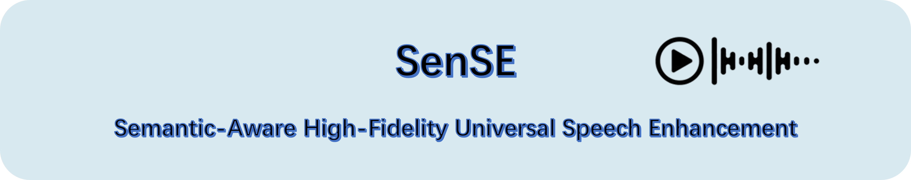

# SenSE: Semantic-Aware High-Fidelity Universal Speech Enhancement

[](https://arxiv.org/abs/2509.24708)
[](https://stellanli.github.io/SenSE-demo/)
[](https://huggingface.co/ASLP-lab/SenSE)

<p align="center">
    
<p>

## Installation

### Create a separate environment if needed

```bash
# Create a python 3.10 conda env (you could also use virtualenv)
conda create -n sense python=3.10
conda activate sense
```

### Install PyTorch with matched device

```bash
> # Install pytorch with your CUDA version, e.g.
conda install pytorch==2.3.0 torchvision==0.18.0 torchaudio==2.3.0 pytorch-cuda=12.1 -c pytorch -c nvidia
```


### Then you can install the environment as follows:

```bash
cd SenSE
# git submodule update --init --recursive  # (optional, if need > bigvgan)
pip install -e .
```


## Inference

Our models are available at https://huggingface.co/ASLP-lab/SenSE.

```bash
accelerate launch src/sense/eval/eval_infer_batch.py \
    --seed 0 \
    --llm_model SenSE_LLM_Base \
    --llm_ckpt_file "/path/to/llm_ckpt" \
    --fm_model SenSE_CFM_Base \
    --fm_ckpt_file "/path/to/cfm_ckpt" \
    --exp_name evaluation \
    --save_sample_rate 16000 \
    --testset dns_challenge_no_reverb \
    --nfestep 8 \
    --cfg_strength 0.5 \
    --swaysampling -1 \
    # --no_ref_audio
```


## Training

```bash
# for LLM stage training:
accelerate launch src/sense/train/train_llm.py \
    --config-name SenSE_LLM_Base.yaml

# for CFM stage training:
accelerate launch src/sense/train/train.py \
    --config-name SenSE_CFM_Base.yaml
```

## Contact Us

If you are interested in leaving a message to our research team, feel free to email `lixingchen0126@gmail.com`.
<p align="center">
    <a href="http://www.nwpu-aslp.org/">
        
    </a>
</p>